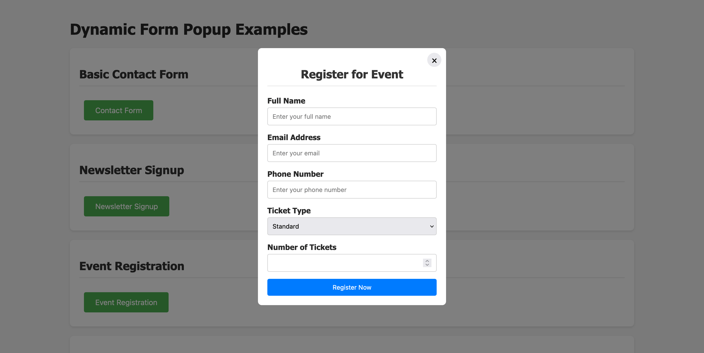

# FormModal

A lightweight (2kb) JavaScript plugin do display dynamic form popups with simple HTML Markups.

It transforms simple HTML buttons into dynamic form popups through data attributes. This plugin eliminates the need for complex form implementations while maintaining flexibility and customization.

## Screenshot



## Key Features

## Beautiful UX

The plugin creates an elegant and intuitive user experience through:

- Smooth animations for modal transitions
- Clean, minimal design that adapts to your site's styling
- Mobile-responsive layout that works across all devices
- Supports simple form validation with instant feedback
- Customizable themes and styling options
- Honeypot (Invisible Field) based bot prevention which is simple yet effective on most bots

### Low Code and Simple Implementation via HTML attributes

```html
<button
  data-title="Sign up for the league"
  data-submit-button-text="Sign Up"
  data-form-modal="[...]"
  data-action-url="https://api.example.com/submit"
>
  Open Signup Form
</button>
```

Attribute *data-form-modal* will enable the button or the link to trigger the form

## Accessible

The plugin follows modern accessibility standards by ensuring keyboard navigation support and screen reader compatibility. All form elements use semantic HTML markup and proper ARIA attributes to maintain accessibility across different assistive technologies.

## Small Size and Very Little Overhead

The plugin is designed to be lightweight and performant, with a compressed size just 2kb (7.4kb minified) to ensure minimal impact on page load time. It uses vanilla JavaScript without dependencies, making it ideal for projects where performance is critical.

## Configuration Options

```javascript
{
    name: "fieldName",        // Form field name attribute
    label: "Field Label",     // Display label
    type: "text|email|tel",   // Input type
    placeholder: "Hint text", // Placeholder text
    required: true|false      // Field validation
}
```

## Use Cases

### Lead Generation

- Newsletter signups
- Event registrations
- Contact forms
- Demo requests
- Subscription forms

### User Engagement

- Quick polls and surveys
- Feedback collection
- Social media follows
- Contest entries

### E-commerce

- Product inquiries
- Size guide requests
- Shipping information
- Price alerts

## Benefits

### Developer Experience

- Zero JavaScript configuration required
- Declarative HTML implementation
- Minimal learning curve
- Reduced development time

### User Experience

- Clean and consistent interface
- Mobile-responsive design
- Smooth animations
- Non-intrusive popups

### Maintenance

- Easy form updates through HTML
- No backend dependencies
- Lightweight footprint
- Cross-browser compatibility

## Integration Example

Add the following script tag to the head of your page

```html
<script
  src="https://cdn.jsdelivr.net/gh/loftdeskdev/FormModal@master/dist/formmodal.min.js"
  defer
></script>
```

The plugin automatically handles form creation, validation, submission, and error handling while maintaining a clean and professional appearance. Its flexibility allows for various implementations across different website sections without compromising performance or user experience.
